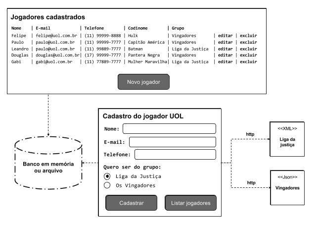
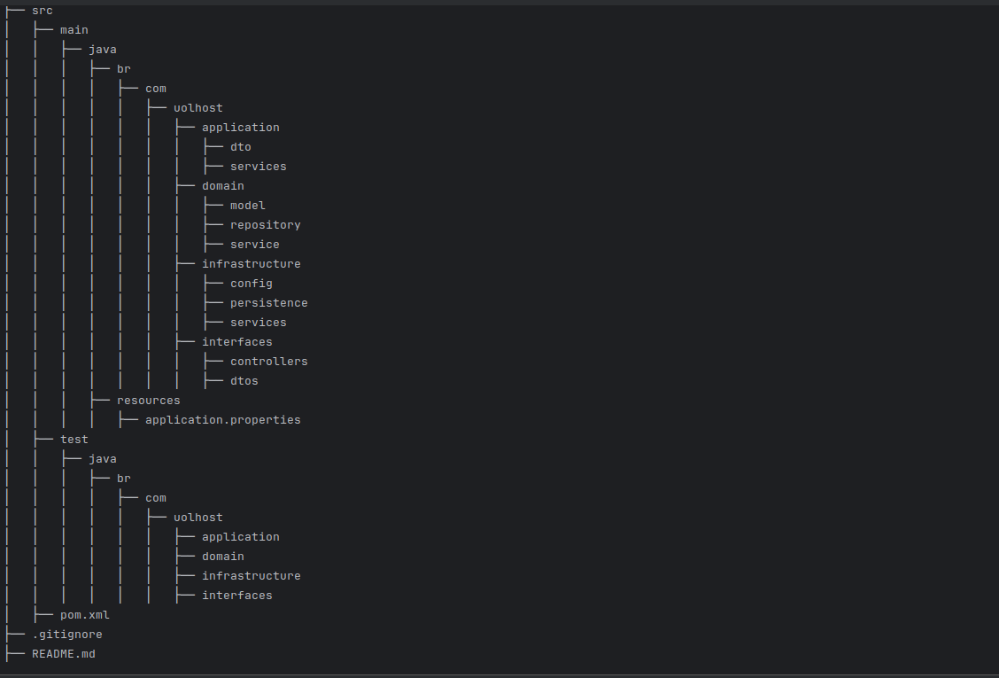
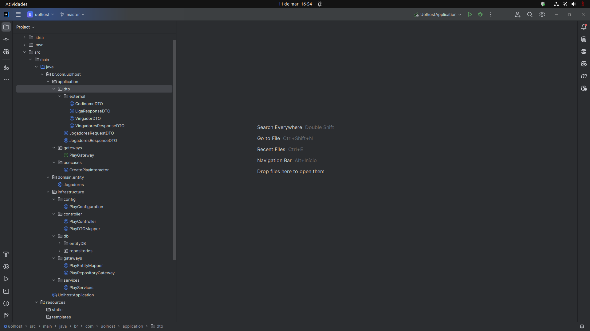

# Desafio backend UOLHOST usando arquitetura clean architecture

<h1 align="center">
    
</h1>
<h1 align="center">
    
    
</h1>

## 💻 Requisitos

No projeto foi utilizado o spring boot e a plataforma intelij idea. Você pode utilizar qualquer plataforma de desenvolvimento, exemplo: eclipse e o Netbeans.

## 🚀 Instalando

Primeiro, você deve clonar o projeto na sua máquina, para isso você
pode colar o seguinte comando em seu terminal

```bash
git clone https://github.com/Tiago-Silva/desafio-uolhost-clean-architecture.git
```

Para instalar as dependências, realize o reload com o Maven, se você preferir pode executar o camando via terminal:

```bash
mvn clean install
```


## 📝 Licença

Este projeto está licenciado sob a licença MIT. Consulte o arquivo `LICENSE` para obter mais informações.

